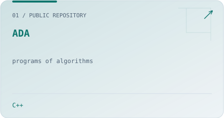
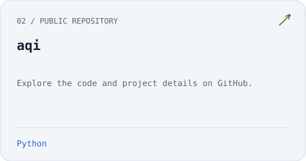
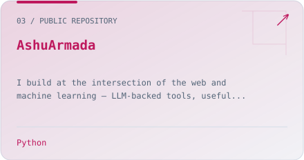
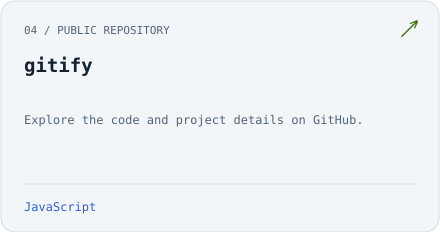
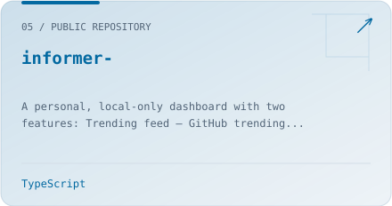
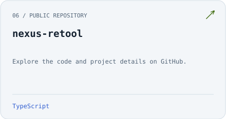
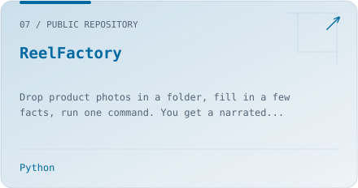
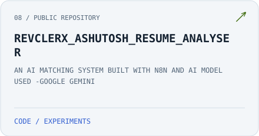
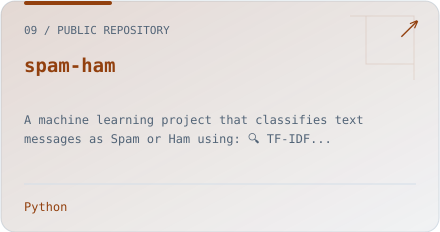
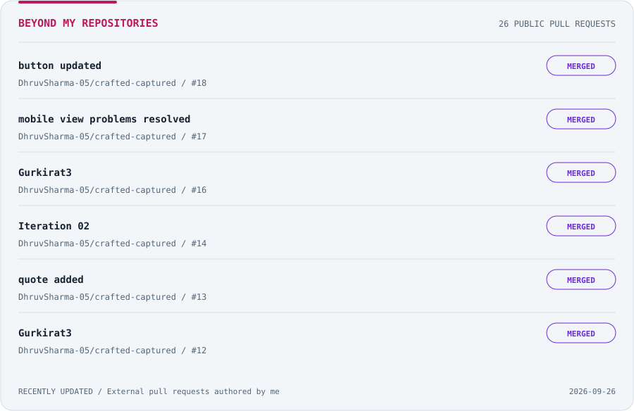

<picture>
  <source media="(prefers-color-scheme: dark)" srcset="assets/header-dark.svg" />
  
</picture>

 

<a href="mailto:thakurashutosh042003@gmail.com"><picture><source media="(prefers-color-scheme: dark)" srcset="assets/chip-email-dark.svg" /></picture></a>
<a href="https://www.linkedin.com/in/ashutosh-thakur-8146121b0/"><picture><source media="(prefers-color-scheme: dark)" srcset="assets/chip-linkedin-dark.svg" /></picture></a>

I build at the intersection of **the web and machine learning** — LLM-backed tools, useful automations, and developer experiences that make complex things easier to understand.

 

### 01 / Projects

Public repositories with a README, updated automatically every day. Add a README to a repository to include it on the next refresh.

<!-- PROJECTS:START -->
<a href="https://github.com/AshuArmada/ADA"><picture><source media="(prefers-color-scheme: dark)" srcset="assets/project-918906835-dark.svg" /></picture></a>
<a href="https://github.com/AshuArmada/aqi"><picture><source media="(prefers-color-scheme: dark)" srcset="assets/project-1090679248-dark.svg" /></picture></a>
<a href="https://github.com/AshuArmada/AshuArmada"><picture><source media="(prefers-color-scheme: dark)" srcset="assets/project-1322846750-dark.svg" /></picture></a>
<a href="https://github.com/AshuArmada/gitify"><picture><source media="(prefers-color-scheme: dark)" srcset="assets/project-1265444681-dark.svg" /></picture></a>
<a href="https://github.com/AshuArmada/informer-"><picture><source media="(prefers-color-scheme: dark)" srcset="assets/project-1301928220-dark.svg" /></picture></a>
<a href="https://github.com/AshuArmada/nexus-retool"><picture><source media="(prefers-color-scheme: dark)" srcset="assets/project-1294163791-dark.svg" /></picture></a>
<a href="https://github.com/AshuArmada/ReelFactory"><picture><source media="(prefers-color-scheme: dark)" srcset="assets/project-1324097908-dark.svg" /></picture></a>
<a href="https://github.com/AshuArmada/REVCLERX_ASHUTOSH_RESUME_ANALYSER"><picture><source media="(prefers-color-scheme: dark)" srcset="assets/project-1115654013-dark.svg" /></picture></a>
<a href="https://github.com/AshuArmada/spam-ham"><picture><source media="(prefers-color-scheme: dark)" srcset="assets/project-1039482909-dark.svg" /></picture></a>
<!-- PROJECTS:END -->

 

### 02 / Under the hood

**Web** &nbsp; JavaScript · TypeScript · React · FastAPI 
**Intelligence** &nbsp; Python · scikit-learn · pandas · Gemini 
**Workflow** &nbsp; Git · Docker · n8n

<picture>
  <source media="(prefers-color-scheme: dark)" srcset="assets/langs-dark.svg" />
  
</picture>

 

### 03 / Cross-repo contributions

<picture>
  <source media="(prefers-color-scheme: dark)" srcset="assets/contributions-dark.svg" />
  
</picture>

<!-- CONTRIBUTIONS:START -->
<a href="https://github.com/DhruvSharma-05/crafted-captured/pull/18">DhruvSharma-05/crafted-captured #18</a> ? <a href="https://github.com/DhruvSharma-05/crafted-captured/pull/17">DhruvSharma-05/crafted-captured #17</a> ? <a href="https://github.com/DhruvSharma-05/crafted-captured/pull/16">DhruvSharma-05/crafted-captured #16</a> ? <a href="https://github.com/DhruvSharma-05/crafted-captured/pull/14">DhruvSharma-05/crafted-captured #14</a> ? <a href="https://github.com/DhruvSharma-05/crafted-captured/pull/13">DhruvSharma-05/crafted-captured #13</a> ? <a href="https://github.com/DhruvSharma-05/crafted-captured/pull/12">DhruvSharma-05/crafted-captured #12</a>
<!-- CONTRIBUTIONS:END -->

Six most recently updated pull requests to repositories owned by others. [View all on GitHub](https://github.com/search?q=is%3Apr+is%3Apublic+author%3AAshuArmada+-user%3AAshuArmada&type=pullrequests). Refreshed daily.

 

### 04 / Work in progress

<picture>
  <source media="(prefers-color-scheme: dark)" srcset="assets/activity-dark.svg" />
  
</picture>

Real commits, pulled from the GitHub API. [Refreshed daily by GitHub Actions](.github/workflows/refresh.yml).

 
 

<a href="mailto:thakurashutosh042003@gmail.com"><picture>
  <source media="(prefers-color-scheme: dark)" srcset="assets/footer-dark.svg" />
  
</picture></a>

Open to collaborating on developer tools and applied ML. [thakurashutosh042003@gmail.com](mailto:thakurashutosh042003@gmail.com)
