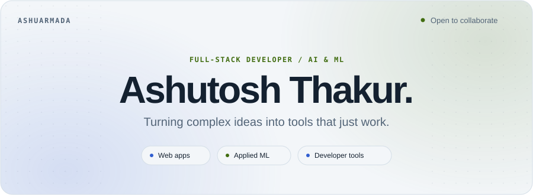
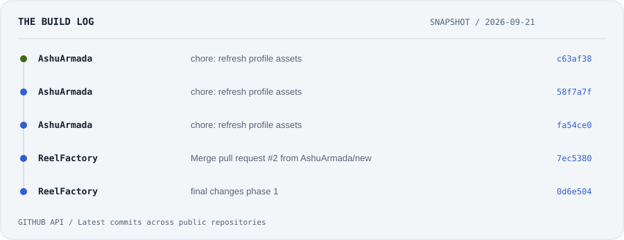
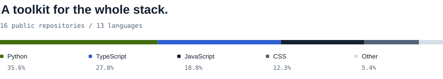

<picture>
  <source media="(prefers-color-scheme: dark)" srcset="assets/header-dark.svg" />
  
</picture>

<a href="mailto:thakurashutosh042003@gmail.com"><picture>
  <source media="(prefers-color-scheme: dark)" srcset="assets/chip-email-dark.svg" />
  
</picture></a>
<a href="https://www.linkedin.com/in/ashutosh-thakur-8146121b0/"><picture>
  <source media="(prefers-color-scheme: dark)" srcset="assets/chip-linkedin-dark.svg" />
  
</picture></a>

<picture>
  <source media="(prefers-color-scheme: dark)" srcset="assets/divider-dark.svg" />
  
</picture>

I work across Python and JavaScript, mostly on the seam between machine learning and the web — LLM-backed tools, workflow automation, and developer tooling.

<picture>
  <source media="(prefers-color-scheme: dark)" srcset="assets/activity-dark.svg" />
  
</picture>

Not a mockup — that's my actual commit history, redrawn daily from the GitHub API by [a workflow](.github/workflows/refresh.yml).

<picture>
  <source media="(prefers-color-scheme: dark)" srcset="assets/divider-dark.svg" />
  
</picture>

### Featured

**[Gitify](https://github.com/AshuArmada/gitify)** — Interactive Git learning environment
Ten structured lessons covering branching, merge conflicts, rebase, stash, cherry-pick, and bisect. Commands run against real Git repos in isolated server-side sandboxes, with animated commit trees and an interactive rebase editor. Falls back to an in-memory Git engine when offline.
`React` `FastAPI` `Docker`  ·  [Live demo →](YOUR-DEPLOY-URL)

 

**[Resume Analyser](https://github.com/AshuArmada/REVCLERX_ASHUTOSH_RESUME_ANALYSER)** — Automated candidate matching
An n8n workflow that parses incoming resumes and scores them against a role description using Google Gemini.
`n8n` `Gemini` `Automation`

 

**[AQI Prediction](https://github.com/AshuArmada/aqi)** — Air quality forecasting
Regression models over historical air-quality data, with feature engineering and evaluation notebooks.
`Python` `scikit-learn` `pandas`

 

**[Spam / Ham Classifier](https://github.com/AshuArmada/spam-ham)** — Text classification
A message classifier built end to end: preprocessing, vectorization, model comparison.
`Python` `NLP`

<picture>
  <source media="(prefers-color-scheme: dark)" srcset="assets/divider-dark.svg" />
  
</picture>

### What I build with

<picture>
  <source media="(prefers-color-scheme: dark)" srcset="assets/langs-dark.svg" />
  
</picture>

<picture>
  <source media="(prefers-color-scheme: dark)" srcset="https://raw.githubusercontent.com/AshuArmada/AshuArmada/output/github-snake-dark.svg" />
  
</picture>

<picture>
  <source media="(prefers-color-scheme: dark)" srcset="assets/divider-dark.svg" />
  
</picture>

**Open to collaborating on developer tools and applied-ML projects.**

Reach me at [thakurashutosh042003@gmail.com](mailto:thakurashutosh042003@gmail.com)

<picture>
  <source media="(prefers-color-scheme: dark)" srcset="assets/footer-dark.svg" />
  
</picture>
